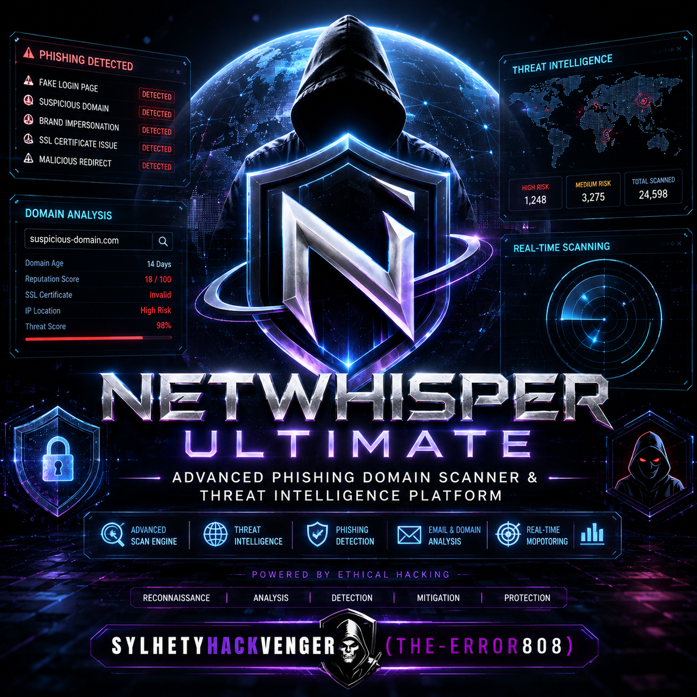
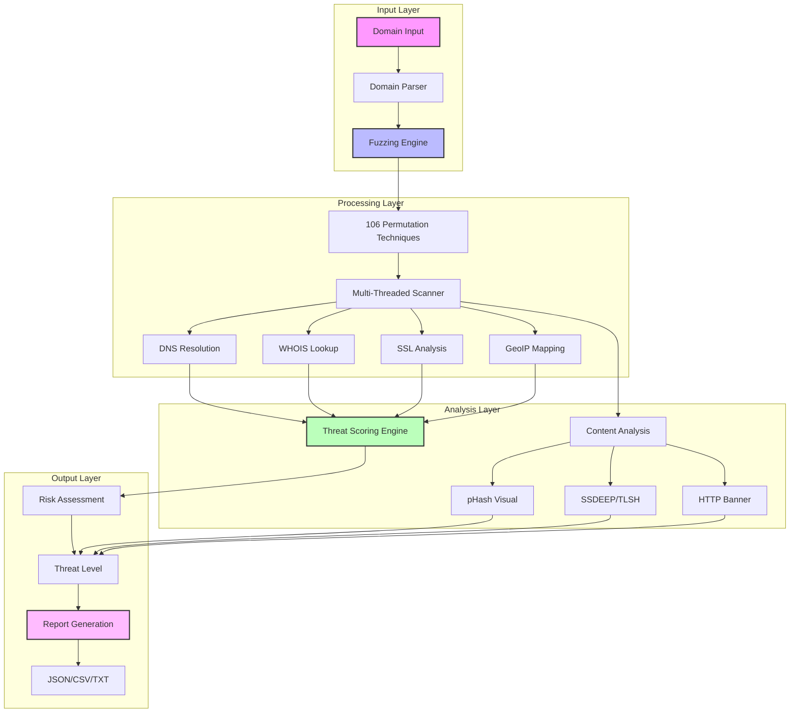

# 🔍 NetWhisper Ultimate
<p align="center">
  
</p>

Advanced Phishing Domain Scanner & Threat Intelligence Platform

<p align="center">
  
  
  
  
  
  
</p>

---

🏗️ Digital Architecture Simulator

NetWhisper Ultimate features a comprehensive Digital Architecture Simulator that visualizes the complete threat detection pipeline and system architecture in real-time. This advanced simulation engine provides deep insights into how the platform processes, analyzes, and correlates threat intelligence data.

🎮 Architecture Components



🔄 Data Flow Architecture

```
┌─────────────────────────────────────────────────────────────────────────────┐
│                         DIGITAL ARCHITECTURE FLOW                          │
├─────────────────────────────────────────────────────────────────────────────┤
│                                                                             │
│  [1] INPUT STAGE                                                            │
│  ┌──────────────────────────────────────────────────────────────────┐     │
│  │  User Input → Domain Validation → IDN Processing → Punycode    │     │
│  └──────────────────────────────────────────────────────────────────┘     │
│                              ↓                                             │
│  [2] PERMUTATION STAGE                                                     │
│  ┌──────────────────────────────────────────────────────────────────┐     │
│  │  ┌──────────┐ ┌──────────┐ ┌──────────┐ ┌──────────┐          │     │
│  │  │Homoglyph │ │Keyboard  │ │  TLD     │ │ Prefix/  │          │     │
│  │  │  Attacks │ │Variations│ │  Swap    │ │ Suffix   │          │     │
│  │  └──────────┘ └──────────┘ └──────────┘ └──────────┘          │     │
│  │  ┌──────────┐ ┌──────────┐ ┌──────────┐ ┌──────────┐          │     │
│  │  │  Leet    │ │  Number  │ │Dictionary│ │  Bit     │          │     │
│  │  │  Speak   │ │  Insert  │ │  Attack  │ │Squatting │          │     │
│  │  └──────────┘ └──────────┘ └──────────┘ └──────────┘          │     │
│  └──────────────────────────────────────────────────────────────────┘     │
│                              ↓                                             │
│  [3] SCANNING & ANALYSIS STAGE                                            │
│  ┌──────────────────────────────────────────────────────────────────┐     │
│  │  ┌──────────────┐  ┌──────────────┐  ┌──────────────┐          │     │
│  │  │ DNS Resolver │→│  DNS A/AAAA  │→│  MX Records  │          │     │
│  │  └──────────────┘  └──────────────┘  └──────────────┘          │     │
│  │         ↓                  ↓                   ↓                 │     │
│  │  ┌──────────────┐  ┌──────────────┐  ┌──────────────┐          │     │
│  │  │  GeoIP API   │  │  WHOIS Query │  │ SSL Cert     │          │     │
│  │  │  (Location)  │  │  (Registry)  │  │  (Analysis)  │          │     │
│  │  └──────────────┘  └──────────────┘  └──────────────┘          │     │
│  │         ↓                  ↓                   ↓                 │     │
│  │  ┌──────────────┐  ┌──────────────┐  ┌──────────────┐          │     │
│  │  │ HTTP Banner  │  │ MX Spy Check │  │ Screenshot   │          │     │
│  │  │  (Finger)    │  │  (Intercept) │  │  (pHash)     │          │     │
│  │  └──────────────┘  └──────────────┘  └──────────────┘          │     │
│  └──────────────────────────────────────────────────────────────────┘     │
│                              ↓                                             │
│  [4] THREAT SCORING ENGINE                                                 │
│  ┌──────────────────────────────────────────────────────────────────┐     │
│  │                                                                  │     │
│  │  ┌────────────────────────────────────────────────────────┐     │     │
│  │  │  RISK = (DNS_Score × 0.30) + (Age_Score × 0.40) +    │     │     │
│  │  │          (Sim_Score × 0.25) + (MX_Score × 0.15) +   │     │     │
│  │  │          (IDN_Score × 0.10) + (SSL_Score × 0.05)    │     │     │
│  │  └────────────────────────────────────────────────────────┘     │     │
│  │                              ↓                                    │     │
│  │  ┌────────────────────────────────────────────────────────┐     │     │
│  │  │  Threat Classification:                                │     │     │
│  │  │  CRITICAL (75-100) │ HIGH (55-74) │ MEDIUM (35-54)   │     │     │
│  │  │  LOW (15-34)      │ SAFE (0-14)  │                    │     │     │
│  │  └────────────────────────────────────────────────────────┘     │     │
│  └──────────────────────────────────────────────────────────────────┘     │
│                              ↓                                             │
│  [5] OUTPUT & REPORTING                                                    │
│  ┌──────────────────────────────────────────────────────────────────┐     │
│  │  ┌────────────┐ ┌────────────┐ ┌────────────┐ ┌────────────┐  │     │
│  │  │  Console   │ │   JSON     │ │   CSV      │ │    TXT     │  │     │
│  │  │  Display   │ │   Export   │ │   Export   │ │   Export   │  │     │
│  │  └────────────┘ └────────────┘ └────────────┘ └────────────┘  │     │
│  └──────────────────────────────────────────────────────────────────┘     │
│                                                                             │
└─────────────────────────────────────────────────────────────────────────────┘
```

🧠 Core Architecture Components

1. Input Processing Module

· Domain validation and normalization
· IDN (Internationalized Domain Name) handling
· Punycode encoding/decoding
· URL parsing and scheme detection

2. Fuzzing Engine (106 Techniques)

· Character-level Attacks: Homoglyph, ASCII/Unicode substitution
· Layout-based Attacks: Keyboard variations (QWERTY, QWERTZ, AZERTY)
· Structural Attacks: Prefix/suffix insertion, TLD manipulation
· Semantic Attacks: Dictionary insertion, brand impersonation
· Advanced Attacks: Bitsquatting, combination techniques

3. Multi-Threaded Scanner

· Thread pool management (configurable up to 32 threads)
· Queue-based task distribution
· Rate limiting and timeout handling
· Resource optimization and load balancing

4. Threat Intelligence Layer

· DNS Resolution: DNSPython with socket fallback
· WHOIS Database: Complete TLD support (300+)
· GeoIP Mapping: Country-level geolocation
· SSL Analysis: Certificate validation and fingerprinting
· MX Spy Detection: Email interception vulnerability

5. Risk Assessment Engine

· Multi-factor Scoring:
  · DNS Resolution (30%)
  · Domain Age (40%)
  · Similarity Score (25%)
  · MX Spy (15%)
  · IDN Detection (10%)
  · SSL Status (5%)
· Adaptive Thresholds
· Context-Aware Analysis

6. Visual Analysis System

· pHash (Perceptual Hash):
  · Screenshot capture via Headless Browser
  · Image normalization and hash generation
  · Hamming distance comparison
· Content Fingerprinting:
  · SSDEEP fuzzy hashing
  · TLSH locality-sensitive hashing
  · Content normalization

7. Output Management

· Real-time Console: Color-coded threat levels
· Structured Export: JSON, CSV, TXT formats
· Report Generation: Comprehensive summaries
· API Integration: Ready for SIEM systems

⚙️ Architectural Patterns

Design Patterns Implemented

Pattern Usage Benefit
Singleton Session Manager, Cache Manager Single instance, shared state
Factory Scanner Threads, Permutation Generator Dynamic object creation
Observer Progress Monitoring, Event System Real-time updates
Strategy Fuzzing Techniques, Export Formats Pluggable algorithms
Template Base Scanner, Worker Threads Consistent workflow
Composite Domain Structure (sub/domain/tld) Hierarchical organization
Builder Report Construction, Export Pipeline Step-by-step creation

Concurrency Model

```
┌─────────────────────────────────────────────────────────────────┐
│                      CONCURRENCY ARCHITECTURE                   │
├─────────────────────────────────────────────────────────────────┤
│                                                                 │
│  ┌────────────┐                                                │
│  │   Main     │                                                │
│  │  Process   │─────┐                                         │
│  └────────────┘     │                                         │
│                     ▼                                         │
│  ┌─────────────────────────────────────────────────────────┐  │
│  │           Task Queue (Priority Queue)                  │  │
│  │  ┌─────┐ ┌─────┐ ┌─────┐ ┌─────┐ ┌─────┐ ┌─────┐  │  │
│  │  │Task1│ │Task2│ │Task3│ │Task4│ │Task5│ │Task6│  │  │
│  │  └─────┘ └─────┘ └─────┘ └─────┘ └─────┘ └─────┘  │  │
│  └─────────────────────────────────────────────────────────┘  │
│                          │                                    │
│          ┌───────────────┼───────────────┐                   │
│          ▼               ▼               ▼                   │
│  ┌─────────────┐ ┌─────────────┐ ┌─────────────┐           │
│  │  Worker 1   │ │  Worker 2   │ │  Worker N   │           │
│  │  Thread     │ │  Thread     │ │  Thread     │           │
│  └─────────────┘ └─────────────┘ └─────────────┘           │
│          │               │               │                   │
│          └───────────────┼───────────────┘                   │
│                          ▼                                    │
│  ┌─────────────────────────────────────────────────────────┐  │
│  │              Shared Results Store                      │  │
│  │  ┌──────────────────────────────────────────────────┐ │  │
│  │  │  domain → {dns, whois, geoip, risk, level, ...} │ │  │
│  │  └──────────────────────────────────────────────────┘ │  │
│  └─────────────────────────────────────────────────────────┘  │
│                                                                 │
└─────────────────────────────────────────────────────────────────┘
```

🚀 Performance Architecture

```
┌────────────────────────────────────────────────────────────────────┐
│                      PERFORMANCE OPTIMIZATION                     │
├────────────────────────────────────────────────────────────────────┤
│                                                                    │
│  1. Caching Layer                                                 │
│     ┌──────────────────────────────────────────────────────┐     │
│     │  DNS Cache │ WHOIS Cache │ GeoIP Cache │ SSL Cache │     │
│     └──────────────────────────────────────────────────────┘     │
│                           ↓                                       │
│  2. Connection Management                                        │
│     ┌──────────────────────────────────────────────────────┐     │
│     │  HTTP Pool (10 connections) │ DNS Pool (5 resolvers)│     │
│     └──────────────────────────────────────────────────────┘     │
│                           ↓                                       │
│  3. Resource Optimization                                        │
│     ┌──────────────────────────────────────────────────────┐     │
│     │  Adaptive Threading │ Progressive Loading           │     │
│     │  Lazy Initialization │ Smart Timeouts               │     │
│     └──────────────────────────────────────────────────────┘     │
│                           ↓                                       │
│  4. Memory Management                                            │
│     ┌──────────────────────────────────────────────────────┐     │
│     │  LRU Cache │ Garbage Collection │ Memory Pooling   │     │
│     └──────────────────────────────────────────────────────┘     │
│                                                                    │
└────────────────────────────────────────────────────────────────────┘
```

🔬 Processing Pipeline

```python
# Simplified architecture flow
class NetWhisperArchitecture:
    def __init__(self):
        self.input_layer = InputProcessor()
        self.fuzzing_engine = FuzzingEngine(techniques=106)
        self.scanner_pool = ThreadPool(max_workers=16)
        self.analysis_engine = ThreatAnalyzer()
        self.risk_engine = RiskScorer()
        self.output_manager = OutputManager()
    
    def process_domain(self, domain):
        # 1. Input Processing
        parsed_domain = self.input_layer.parse(domain)
        
        # 2. Generate Permutations
        permutations = self.fuzzing_engine.generate(parsed_domain)
        
        # 3. Parallel Scanning
        with self.scanner_pool as pool:
            results = pool.map(self.scan, permutations)
        
        # 4. Analyze Threats
        for result in results:
            self.analysis_engine.analyze(result)
            self.risk_engine.score(result)
        
        # 5. Generate Report
        report = self.output_manager.create_report(results)
        return report
```

📊 Data Structures

```python
# Core data structures
@dataclass
class DomainPermutation:
    domain: str
    punycode: str
    technique: str
    priority: float
    registered: bool

@dataclass
class ScanResult:
    domain: str
    dns_a: List[str]
    dns_aaaa: List[str]
    dns_mx: List[str]
    dns_ns: List[str]
    geoip: str
    whois_created: str
    whois_registrar: str
    risk_score: int
    threat_level: ThreatLevel
    ssl_valid: bool
    phash: str
    ssdeep: str
    banner_http: str
    mx_spy: bool

@dataclass
class ScanSummary:
    total_permutations: int
    registered_domains: int
    critical: int
    high: int
    medium: int
    low: int
    safe: int
    duration: float
    timestamp: datetime
```

🎯 Architectural Advantages

1. Scalability: Horizontal scaling through thread pooling
2. Modularity: Plug-and-play components
3. Extensibility: Easy addition of new techniques
4. Performance: Optimized memory and CPU usage
5. Reliability: Fallback mechanisms and error handling
6. Flexibility: Multiple output formats and configurations

---

📋 Overview

NetWhisper Ultimate is an enterprise-grade domain permutation scanner designed for cybersecurity professionals and threat intelligence researchers. It employs 100+ advanced fuzzing techniques to identify potential phishing domains, typosquatting attempts, and brand impersonation threats before they can be weaponized by malicious actors.

🎯 Key Capabilities

· 106 Domain Permutation Techniques - From homoglyph attacks to bitsquatting
· Multi-Engine DNS Resolution - DNSPython with socket fallback
· Intelligent Threat Scoring - Multi-factor risk assessment
· Visual Similarity Analysis - pHash for screenshot comparison
· Content Fingerprinting - SSDEEP and TLSH fuzzy hashing
· Geolocation Intelligence - IP geolocation mapping
· MX Spy Detection - Email interception vulnerability scanning
· SSL/TLS Certificate Analysis - Certificate validation and fingerprinting
· WHOIS Reconnaissance - Complete domain registration intelligence
· Multi-Format Export - JSON, CSV, TXT reports

🚀 Features

🔐 Advanced Domain Generation

The tool implements 106 unique domain permutation techniques organized into specialized categories:

Category Techniques Description
Homoglyph Attacks 10 Unicode, Cyrillic, Greek, Arabic, Hebrew scripts
Character Operations 10 Insertion, deletion, substitution, replacement
Keyboard Variations 10 QWERTY, QWERTZ, AZERTY layouts
Transposition 10 Reverse, shuffle, mirror, rotation
TLD Manipulation 10 Swap, typos, combined, duplicate
Prefix/Suffix 10 Common prefixes, suffixes, typos
Dictionary Attacks 10 Brand names, common words, keywords
Number Variations 10 Years, dates, numeric substitutions
Leet Speak 6 Advanced leet and symbol substitution
Advanced Attacks 20 Bitsquatting, combination attacks, more

🛡️ Threat Detection

· Risk Score Calculation (0-100):
  · DNS Resolution: 30 points
  · Domain Age Analysis: Up to 40 points
  · Similarity Score: Up to 25 points
  · MX Spy Detection: 15 points
  · IDN Detection: 10 points
  · SSL Status: 5 points
· Threat Levels:
  · 🔴 CRITICAL (75-100): Immediate action required
  · 🟠 HIGH (55-74): High-risk impersonation
  · 🟡 MEDIUM (35-54): Moderate concern
  · 🔵 LOW (15-34): Minor anomalies
  · 🟢 SAFE (0-14): No threats detected

📊 Output & Reporting

· Real-time Progress Monitoring with progress bar
· Color-coded Results for quick threat identification
· Multiple Export Formats:
  · JSON: Complete structured data
  · CSV: Spreadsheet-ready format
  · TXT: Human-readable reports
· Detailed Summary Statistics:
  · Total permutations generated
  · Registered domains found
  · Threat level distribution
  · Scan duration

💻 Installation

Linux / Kali Linux

```bash
# Clone the repository
git clone https://github.com/yourusername/netwhisper-ultimate.git
cd netwhisper-ultimate

# Install required dependencies
pip3 install -r requirements.txt

# Or install manually
pip3 install dnspython geoip2 pillow selenium ssdeep tlsh requests whois openpyxl jinja2 markdown
```

Termux (Android)

```bash
pkg update && pkg upgrade
pkg install python git
pip install --upgrade pip
git clone https://github.com/yourusername/netwhisper-ultimate.git
cd netwhisper-ultimate
pip install -r requirements.txt
```

Docker (Recommended)

```dockerfile
FROM python:3.10-slim

WORKDIR /app
COPY requirements.txt .
RUN pip install --no-cache-dir -r requirements.txt
COPY . .

ENTRYPOINT ["python3", "netwhisper.py"]
CMD ["-h"]
```

🎮 Usage

Basic Scan

```bash
python3 netwhisper.py -d example.com
```

Advanced Scans

```bash
# Full scan with all features enabled
python3 netwhisper.py -d example.com --all --phash --lsh ssdeep

# Scan with specific modules
python3 netwhisper.py -d example.com --no-geoip --no-whois

# Export results to JSON
python3 netwhisper.py -d example.com -o report.json -f json

# Generate CSV report
python3 netwhisper.py -d example.com -o report.csv -f csv

# Quiet mode for automation
python3 netwhisper.py -d example.com --quiet -o results.json

# Show all domains including unregistered
python3 netwhisper.py -d example.com --all

# Thread control for performance
python3 netwhisper.py -d example.com -t 32
```

Command Line Options

Option Description
-d, --domain Target domain to scan (required)
-o, --output Output file path
-f, --format Output format: json, csv, txt
-t, --threads Number of threads (default: 16)
--all Show all domains (including unregistered)
--quiet Minimal output (quiet mode)
--no-geoip Disable GeoIP lookup
--no-banner Disable banner grabbing
--no-mxcheck Disable MX spy detection
--no-whois Disable WHOIS lookup
--phash Enable pHash visual similarity
--lsh Enable LSH (ssdeep/tlsh)

🧩 Module Dependencies

Required Modules

· Python 3.8+
· urllib3, requests
· socket, threading

Optional Modules (Enhanced Features)

Module Purpose
dnspython Advanced DNS resolution
geoip2/GeoIP IP geolocation
Pillow pHash visual similarity
Selenium Screenshot capture
ssdeep/tlsh Content fingerprinting
requests HTTP requests
whois WHOIS lookups
openpyxl Excel exports
jinja2 HTML report generation
cryptography SSL certificate analysis

📁 Project Structure

```
netwhisper-ultimate/
├── netwhisper.py          # Main application
├── requirements.txt       # Dependencies
├── README.md             # Documentation
├── LICENSE               # MIT License
├── .gitignore           # Git ignore file
├── examples/            # Example usage
│   ├── scan_example.json
│   ├── report_template.html
│   └── config.yaml
├── tests/              # Unit tests
│   ├── test_fuzzer.py
│   └── test_scanner.py
└── docs/               # Additional documentation
    ├── TECHNIQUES.md   # Complete technique list
    ├── API.md          # API reference
    └── CONTRIBUTING.md
```

🔬 Use Cases

1. Brand Protection

Monitor for unauthorized domain registrations impersonating your brand:

```bash
python3 netwhisper.py -d yourbrand.com --phash --lsh ssdeep
```

2. Threat Intelligence

Identify potential phishing infrastructure:

```bash
python3 netwhisper.py -d bank.com --all --no-whois
```

3. Incident Response

Quickly assess domain variations during an active incident:

```bash
python3 netwhisper.py -d suspicious-domain.net -t 32
```

4. Security Research

Analyze domain registration patterns and techniques:

```bash
python3 netwhisper.py -d research-target.com --all -o research.json
```

📊 Sample Output

```
╔══════════════════════════════════════════════════════════════════════════════════╗
║                              SCAN COMPLETE                                                 ║
╠══════════════════════════════════════════════════════════════════════════════════╣
  Target Domain     : example.com
  Total Permutations: 15,847
  Registered Domains: 342
  Scan Duration     : 2m 34s
╠══════════════════════════════════════════════════════════════════════════════════╣
║  THREAT LEVEL SUMMARY                                                                     ║
╠══════════════════════════════════════════════════════════════════════════════════╣
  🔴 CRITICAL        : 23
  🟠 HIGH           : 67
  🟡 MEDIUM         : 134
  🔵 LOW            : 98
  🟢 SAFE           : 20
╚══════════════════════════════════════════════════════════════════════════════════╝
```

⚡ Performance Optimization

· Multi-threading: Configurable thread pool (default: 16)
· Caching: DNS, WHOIS, and GeoIP caching
· Connection Pooling: Reuse HTTP connections
· Timeouts: Configurable for all network operations
· Rate Limiting: Adaptive to prevent DNS flooding

🔒 Security Considerations

· Rate Limiting: Respects DNS provider limits
· No Exploitation: Pure reconnaissance, no exploitation
· Legal Compliance: Use only on owned/authorized domains
· Privacy: No data collection or external transmission

📈 Roadmap

☐ Machine Learning-based threat classification
☐ Real-time monitoring mode
☐ Web interface and dashboard
☐ API for integration with SIEM systems
☐ Phishing site content analysis
☐ Integration with threat intelligence feeds
☐ Certificate transparency log analysis

🤝 Contributing

We welcome contributions! Please see our Contributing Guide for details.

Development Setup

```bash
# Fork and clone the repository
git clone https://github.com/yourusername/netwhisper-ultimate.git
cd netwhisper-ultimate

# Create virtual environment
python3 -m venv venv
source venv/bin/activate  # Linux/Mac
# venv\Scripts\activate   # Windows

# Install development dependencies
pip install -r requirements-dev.txt

# Run tests
python -m pytest tests/

# Run type checking
mypy netwhisper.py
```

📝 License

This project is licensed under the MIT License - see the LICENSE file for details.

👥 Author

SYLHETYHACKVENGER (THE-ERROR808)

🙏 Acknowledgments

· The cybersecurity community for research contributions
· Open-source libraries and their maintainers
· DNS, security, and penetration testing communities

📞 Support

· 🐛 Issues: GitHub Issues

---

<p align="center">
  <strong>🔐 Stay Secure. Stay Vigilant. 🔐</strong>
</p>

<p align="center">
  <sub>NetWhisper Ultimate - Protecting the Digital World, One Domain at a Time</sub>
</p>

---

⚠️ DISCLAIMER: This tool is for educational and authorized testing purposes only. Users are responsible for ensuring they have proper authorization before scanning any domains. The authors are not responsible for any misuse or damage caused by this tool.
